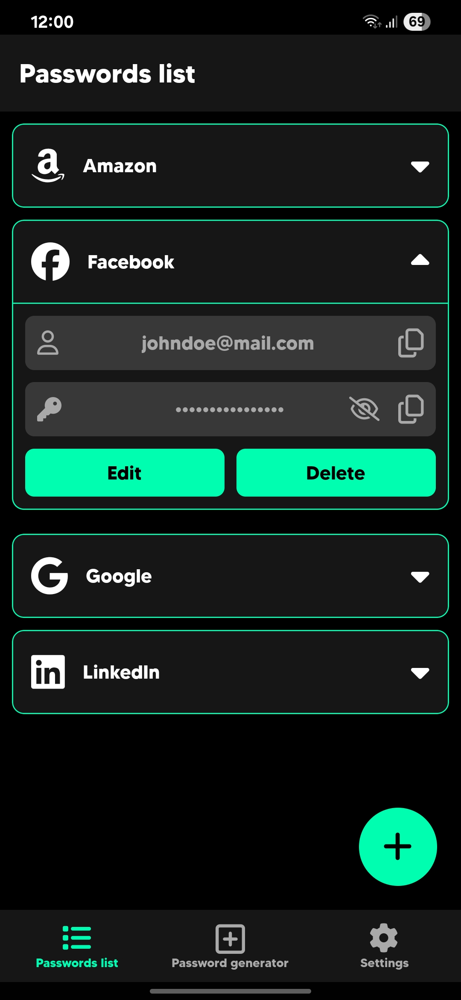
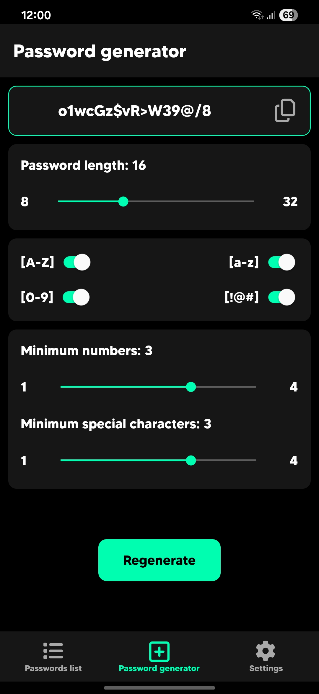
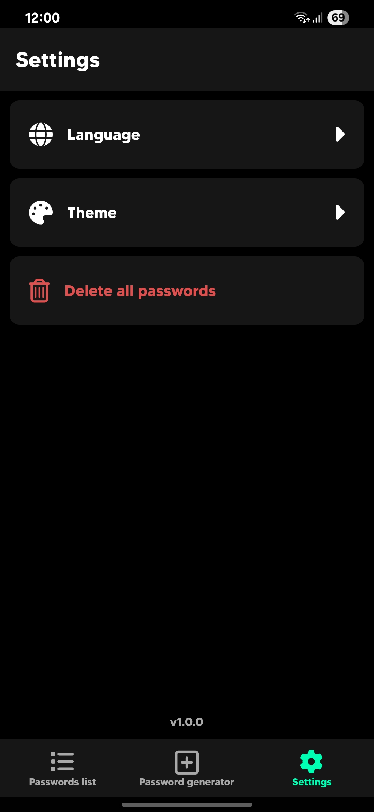

# 🔐 QuickPass

A simple and secure password management app built with React Native and Expo.

## ✨ Features
- quickly generate strong passwords up to 64 characters long,
- add, view, edit and delete saved passwords,
- secure storage using Expo SecureStore,
- multi-language support (with more languages incoming in the future),
- light and dark mode (with themes incoming)

## 📲 Installation

1. **Clone this repository**

   ```bash
   git clone https://github.com/f1shuu/quickpass.git
   ```

2. **Install dependencies**

   ```bash
   npm i
   ```

3. **Start the project**

   ```bash
   npx expo start
   ```

## 📦 Download

You can download the latest Android APK from the **Releases** page.

## 🖼️ Screenshots

<p align="center">
    
    
    
</p>

<p align="center">
    <span style="display: inline-block; width: 250px; text-align: center; margin: 0 12px;">Passwords list screen</span>
    <span style="display: inline-block; width: 250px; text-align: center; margin: 0 12px;">Password generator</span>
    <span style="display: inline-block; width: 250px; text-align: center; margin: 0 12px;">Settings screen</span>
</p>

## 🛠️ Tech Stack

- React Native,
- Expo,
- React Navigation,
- Expo SecureStore.

## 📄 License

This project is licensed under the MIT License.