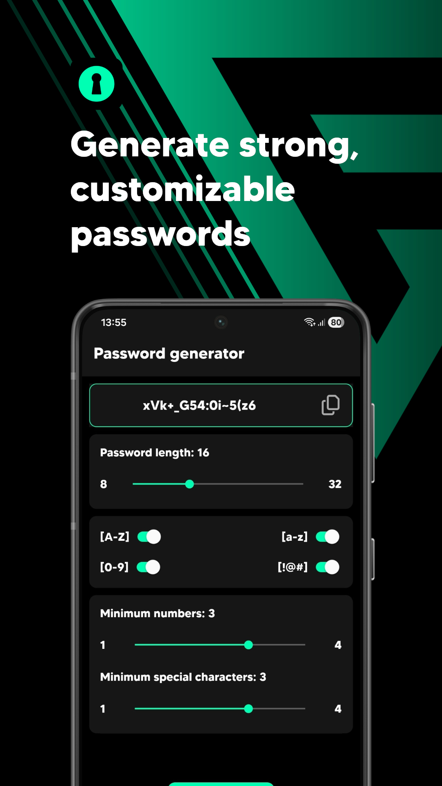
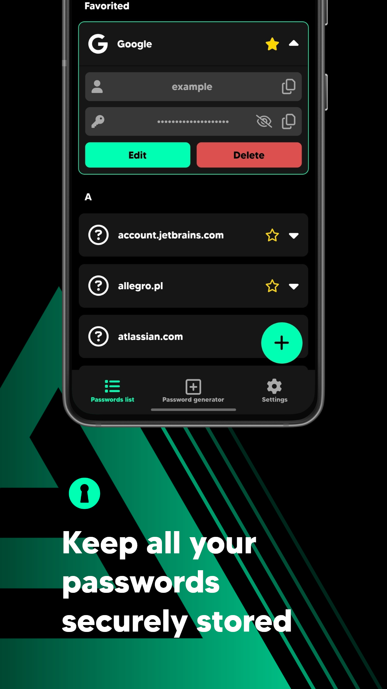
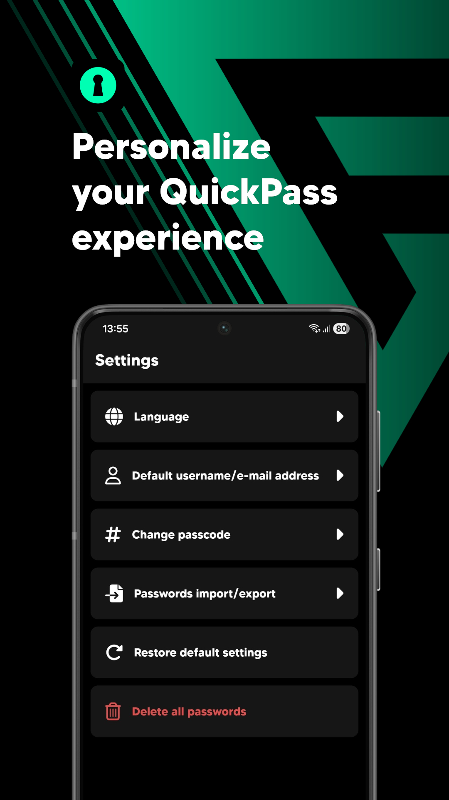

<div align="center">
   
   <h1 align="center">QuickPass</h1>

**A simple and secure password generator and manager, built for storing many passwords effortlessly.**

   <p align="center"><a href="https://github.com/f1shuu/quickpass/releases"></a>&nbsp;<a href="LICENSE"></a></p>
</div>

<div align="center" style="display:flex;justify-content:center;gap:10px;flex-wrap:nowrap;">
    
    
    
</div>

## Features

- **password generation**: create strong passwords up to 32 characters long with customizable generation options
- **password vault**: add, view, edit, delete, and organize saved credentials in one secure place
- **search & filtering**: quickly find entries by title, website, or notes with fast local lookup
- **CSV import/export**: back up or restore your entire password collection as CSV files
- **secure storage**: keep your data protected with Expo SecureStore and local device-based security
- **multi-language support**: use the app in multiple languages for a more accessible experience
- **favorites & quick access**: pin important passwords and keep frequently used entries within easy reach
- **copy & share**: copy credentials to the clipboard or share selected items securely when needed

## Download

You can download the latest Android APK from the [Releases](https://github.com/f1shuu/quickpass/releases) page.

## For developers

### Quick start

```bash
git clone git@github.com:f1shuu/quickpass.git
npm i
npx expo start
```

### Tech stack

- **React Native 0.86** and **React 19** for the mobile interface
- **Expo SDK 57** for development, native APIs, and application builds
- **React Navigation 7** for tab and stack navigation
- **AsyncStorage** for persistent local settings and domain data
- **Expo modules** for audio, fonts, haptics, localization, assets, and gradients
- **React Native Gesture Handler** and **React Native SVG** for gestures and visual components

## License

This project is licensed under the [MIT License](LICENSE).
