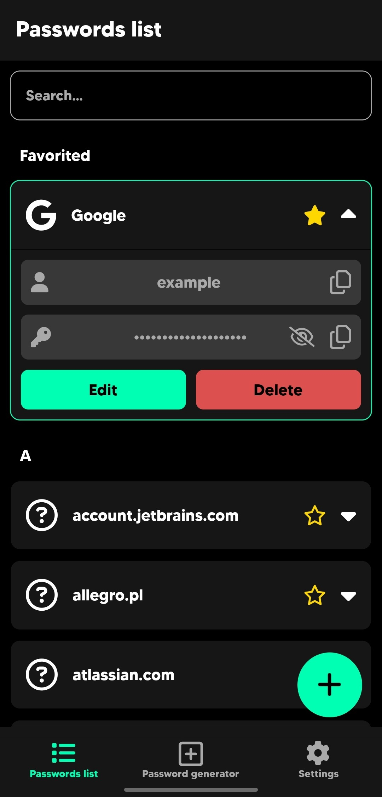
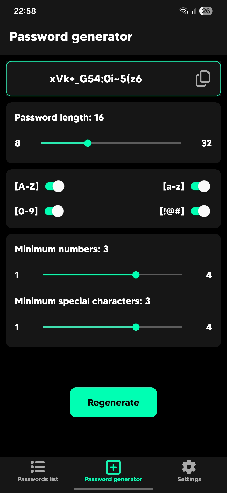
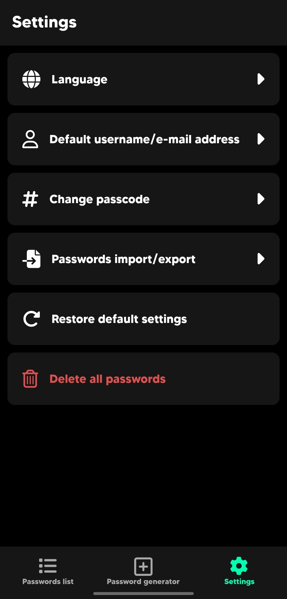

# QuickPass

A simple and secure password management app built with React Native and Expo.

## Features
- quickly generate strong passwords up to 32 characters long,
- add, view, edit and delete saved passwords,
- import and export all passwords as CSV files,
- secure storage using Expo SecureStore,
- multi-language support.

## Installation

1. **Clone this repository**

   ```bash
   git clone git@github.com:f1shuu/quickpass.git
   ```

2. **Install dependencies**

   ```bash
   npm install
   ```

3. **Start the project**

   ```bash
   npx expo start
   ```

## Download

You can download the latest Android APK from the [Releases](https://github.com/f1shuu/quickpass/releases) page.

## Screenshots

<div align="center" style="display:flex;justify-content:center;gap:10px;flex-wrap:nowrap;">
    
    
    
</div>

## Tech Stack

- React Native,
- Expo,
- React Navigation,
- Expo SecureStore.

## License

This project is licensed under the MIT License.
